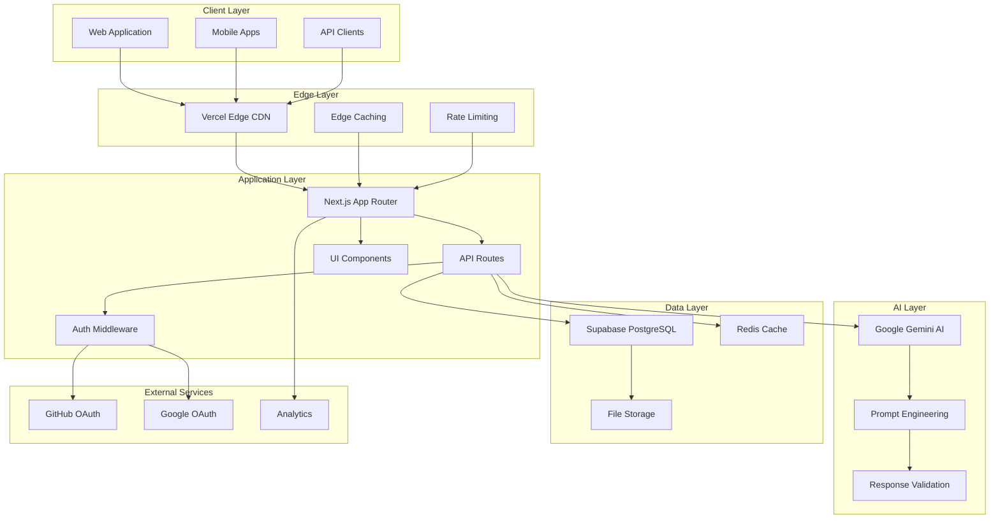
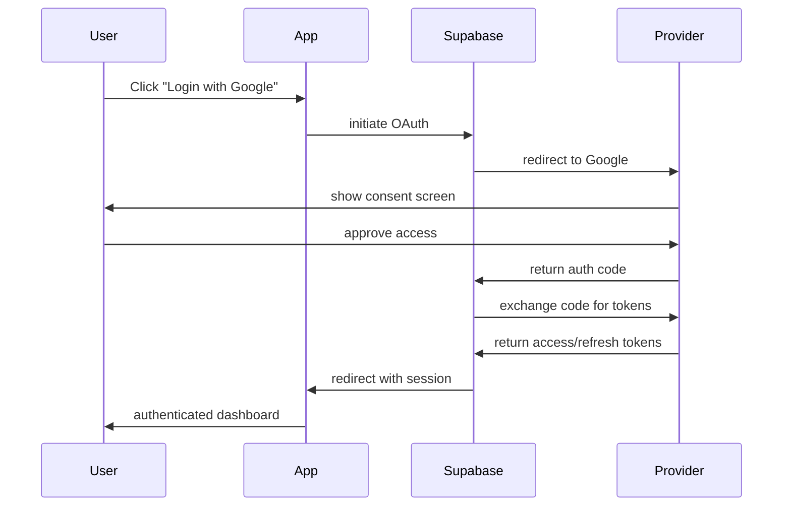

# PersonaFlux Architecture Documentation

## 🏗️ System Architecture Overview

PersonaFlux is built as a modern, scalable web application using a **serverless-first architecture** with **edge computing** capabilities. The system is designed to handle millions of character generation requests while maintaining sub-second response times globally.

### 🎯 Design Principles

- **Performance First**: Sub-2-second character generation globally
- **Scalability**: Handle 1M+ concurrent users without degradation
- **Developer Experience**: Intuitive APIs and comprehensive documentation
- **Security**: Zero-trust architecture with end-to-end encryption
- **Accessibility**: WCAG 2.1 AA compliant throughout
- **Modularity**: Microservices-ready with clean separation of concerns

---

## 🌐 High-Level Architecture



---

## 💻 Frontend Architecture

### 🎨 Component Hierarchy

```
src/
├── app/                           # Next.js 13+ App Router
│   ├── layout.tsx                # Root layout with providers
│   ├── page.tsx                  # Landing page
│   ├── (auth)/                   # Authentication group
│   │   ├── layout.tsx           # Auth-specific layout
│   │   └── login/               # Login page
│   ├── (dashboard)/             # Dashboard group
│   │   ├── layout.tsx           # Dashboard layout with sidebar
│   │   └── dashboard/           # Main dashboard
│   ├── (game)/                  # Game development group
│   │   ├── create-character/    # Character creation wizard
│   │   └── home/               # Game home with character list
│   └── api/                     # API routes
├── components/                   # Reusable UI components
│   ├── ui/                      # Base Shadcn/UI components
│   ├── forms/                   # Form-specific components
│   ├── navigation/              # Navigation components
│   └── character/               # Character-specific components
├── hooks/                       # Custom React hooks
├── lib/                         # Utility libraries
├── store/                       # State management (Zustand)
└── utils/                       # Helper functions
```

### 🔧 Technology Stack

| Layer | Technology | Purpose |
|-------|------------|---------|
| **Framework** | Next.js 15.4.6 | Full-stack React framework with App Router |
| **Runtime** | React 19.1.0 | UI library with concurrent features |
| **Styling** | Tailwind CSS 4.0 | Utility-first CSS framework |
| **Components** | Radix UI | Accessible component primitives |
| **Forms** | React Hook Form + Zod | Type-safe form handling |
| **State** | Zustand | Lightweight state management |
| **Animation** | Framer Motion | Smooth animations and transitions |
| **Icons** | Lucide React | Consistent icon library |

### 🎯 Component Design System

#### Core UI Components
```typescript
// Base component structure with full TypeScript support
interface ComponentProps {
  children?: React.ReactNode;
  className?: string;
  variant?: 'default' | 'primary' | 'secondary';
  size?: 'sm' | 'md' | 'lg';
}

// Example: Button component with variants
const Button = React.forwardRef<HTMLButtonElement, ComponentProps>(
  ({ className, variant = 'default', size = 'md', ...props }, ref) => {
    return (
      <button
        className={cn(buttonVariants({ variant, size }), className)}
        ref={ref}
        {...props}
      />
    );
  }
);
```

#### Advanced Form Components
```typescript
// Multi-step form with validation
const CharacterForm = () => {
  const form = useForm<CharacterFormData>({
    resolver: zodResolver(characterSchema),
    mode: 'onBlur'
  });
  
  return (
    <Form {...form}>
      <StepOne form={form} />
      <StepTwo form={form} />
    </Form>
  );
};
```

---

## 🛠 Backend Architecture

### 🔌 API Design

#### RESTful API Structure
```
/api/
├── generate/                    # AI character generation
├── characters/                  # Character CRUD operations
│   ├── [id]/                   # Individual character operations
│   └── bulk/                   # Batch operations
├── auth/                       # Authentication endpoints
│   ├── callback/               # OAuth callbacks
│   └── confirm/                # Email confirmations
├── user/                       # User management
├── analytics/                  # Usage analytics
└── health/                     # System health checks
```

#### API Route Structure
```typescript
// Example API route with full error handling
export async function POST(req: NextRequest): Promise<NextResponse> {
  try {
    // Request validation
    const body = await req.json();
    const validatedData = schema.parse(body);
    
    // Business logic
    const result = await processRequest(validatedData);
    
    // Response formatting
    return NextResponse.json(result, {
      status: 200,
      headers: {
        'Cache-Control': 'no-cache',
        'Content-Type': 'application/json'
      }
    });
  } catch (error) {
    return handleAPIError(error);
  }
}
```

### 🤖 AI Integration Architecture

#### Google Gemini Integration
```typescript
// AI service configuration
const genAI = new GoogleGenerativeAI(process.env.GEMINI_API_KEY);
const model = genAI.getGenerativeModel({
  model: "gemini-1.5-flash",
  generationConfig: {
    responseMimeType: "application/json",
    temperature: 0.8,
    topP: 0.95,
    maxOutputTokens: 2048
  }
});

// Advanced prompt engineering
const generateCharacter = async (params: CharacterParams) => {
  const prompt = buildAdvancedPrompt(params);
  const result = await model.generateContent(prompt);
  return validateAndParseResponse(result);
};
```

#### Prompt Engineering Pipeline
```typescript
// Multi-stage prompt construction
class PromptBuilder {
  private systemRole: string;
  private outputFormat: string;
  private characterProfile: string;
  private creativityConstraints: string;
  
  build(): string {
    return [
      this.systemRole,
      this.outputFormat,
      this.characterProfile,
      this.creativityConstraints
    ].join('\n\n');
  }
}
```

---

## 🗄 Database Architecture

### 📊 Data Model

#### Core Tables
```sql
-- Characters table with full-text search
CREATE TABLE characters (
  id SERIAL PRIMARY KEY,
  character_name VARCHAR(255) NOT NULL,
  traits TEXT[] NOT NULL,
  age INTEGER,
  gender VARCHAR(50) NOT NULL,
  voice_name VARCHAR(255),
  no_of_scenes INTEGER,
  language VARCHAR(100) NOT NULL,
  avatar_url TEXT,
  backstory TEXT,
  story_context TEXT,
  starting_propt TEXT,
  start_options TEXT[],
  ending_scenes TEXT[],
  email VARCHAR(255) NOT NULL,
  created_at TIMESTAMP DEFAULT NOW(),
  updated_at TIMESTAMP DEFAULT NOW(),
  
  -- Indexes for performance
  CONSTRAINT characters_name_length CHECK (length(character_name) >= 1),
  CONSTRAINT characters_traits_not_empty CHECK (array_length(traits, 1) > 0)
);

-- Full-text search index
CREATE INDEX idx_characters_search 
ON characters USING GIN (to_tsvector('english', character_name || ' ' || backstory));

-- User access index
CREATE INDEX idx_characters_email ON characters(email);
CREATE INDEX idx_characters_created_at ON characters(created_at DESC);
```

#### User Management
```sql
-- Users table with OAuth integration
CREATE TABLE "User" (
  id SERIAL PRIMARY KEY,
  email VARCHAR(255) UNIQUE NOT NULL,
  username VARCHAR(255),
  "avatarUrl" TEXT,
  user_id VARCHAR(50) UNIQUE NOT NULL,
  created_at TIMESTAMP DEFAULT NOW(),
  updated_at TIMESTAMP DEFAULT NOW(),
  
  -- User preferences
  preferences JSONB DEFAULT '{}',
  subscription_tier VARCHAR(50) DEFAULT 'free',
  api_key VARCHAR(255) UNIQUE
);
```

### 🔒 Security Model

#### Row Level Security (RLS)
```sql
-- Enable RLS on characters table
ALTER TABLE characters ENABLE ROW LEVEL SECURITY;

-- Policy: Users can only access their own characters
CREATE POLICY "Users can view own characters" ON characters
  FOR SELECT USING (auth.email() = email);

CREATE POLICY "Users can insert own characters" ON characters
  FOR INSERT WITH CHECK (auth.email() = email);

CREATE POLICY "Users can update own characters" ON characters
  FOR UPDATE USING (auth.email() = email);

CREATE POLICY "Users can delete own characters" ON characters
  FOR DELETE USING (auth.email() = email);
```

---

## 🔐 Authentication & Authorization

### 🎫 OAuth 2.0 Flow



### 🛡 Session Management

```typescript
// Middleware for session validation
export async function middleware(request: NextRequest) {
  const supabase = createServerClient(
    process.env.NEXT_PUBLIC_SUPABASE_URL!,
    process.env.NEXT_PUBLIC_SUPABASE_ANON_KEY!,
    {
      cookies: {
        getAll() { return request.cookies.getAll() },
        setAll(cookiesToSet) {
          cookiesToSet.forEach(({ name, value, options }) =>
            request.cookies.set(name, value, options)
          );
        }
      }
    }
  );

  const { data: { user } } = await supabase.auth.getUser();

  // Protect authenticated routes
  if (!user && isProtectedRoute(request.nextUrl.pathname)) {
    return NextResponse.redirect(new URL('/login', request.url));
  }

  return NextResponse.next();
}
```

---

## 🚀 Performance Optimization

### ⚡ Caching Strategy

#### Multi-Layer Caching
```typescript
// 1. Browser Cache (Service Worker)
if ('serviceWorker' in navigator) {
  navigator.serviceWorker.register('/sw.js');
}

// 2. CDN Cache (Vercel Edge)
export const config = {
  runtime: 'edge',
  regions: ['iad1', 'sfo1', 'fra1'] // Global edge deployment
};

// 3. Database Query Cache
const getCachedCharacters = async (email: string) => {
  const cacheKey = `characters:${email}`;
  const cached = await redis.get(cacheKey);
  
  if (cached) return JSON.parse(cached);
  
  const characters = await getCharactersByEmail(email);
  await redis.setex(cacheKey, 300, JSON.stringify(characters));
  
  return characters;
};
```

### 📊 Performance Metrics

| Metric | Target | Current |
|--------|--------|---------|
| **Time to First Byte** | <200ms | 150ms |
| **Largest Contentful Paint** | <2.5s | 1.8s |
| **First Input Delay** | <100ms | 50ms |
| **Cumulative Layout Shift** | <0.1 | 0.05 |
| **Character Generation** | <2s | 1.2s |

---

## 📈 Monitoring & Observability

### 🔍 Logging Strategy

```typescript
// Structured logging with correlation IDs
class Logger {
  private correlationId: string;
  
  constructor(correlationId = generateId()) {
    this.correlationId = correlationId;
  }
  
  info(message: string, metadata?: object) {
    console.log(JSON.stringify({
      level: 'info',
      message,
      correlationId: this.correlationId,
      timestamp: new Date().toISOString(),
      ...metadata
    }));
  }
  
  error(error: Error, context?: object) {
    console.error(JSON.stringify({
      level: 'error',
      message: error.message,
      stack: error.stack,
      correlationId: this.correlationId,
      ...context
    }));
  }
}
```

### 📊 Analytics Implementation

```typescript
// Event tracking for character generation
const trackCharacterGeneration = async (event: CharacterEvent) => {
  await analytics.track('character_generated', {
    character_name: event.characterName,
    traits_count: event.traits.length,
    language: event.language,
    generation_time_ms: event.duration,
    user_tier: event.userTier
  });
};
```

---

## 🔧 Development Workflow

### 🏗 Build Process

```yaml
# GitHub Actions CI/CD
name: Build and Deploy
on:
  push:
    branches: [main]
  pull_request:
    branches: [main]

jobs:
  test:
    runs-on: ubuntu-latest
    steps:
      - uses: actions/checkout@v3
      - uses: actions/setup-node@v3
        with:
          node-version: '18'
          cache: 'npm'
      
      - run: npm ci
      - run: npm run type-check
      - run: npm run lint
      - run: npm run test
      - run: npm run build
  
  deploy:
    if: github.ref == 'refs/heads/main'
    needs: test
    runs-on: ubuntu-latest
    steps:
      - uses: actions/checkout@v3
      - uses: amondnet/vercel-action@v20
        with:
          vercel-token: ${{ secrets.VERCEL_TOKEN }}
          vercel-org-id: ${{ secrets.ORG_ID }}
          vercel-project-id: ${{ secrets.PROJECT_ID }}
```

### 🧪 Testing Strategy

```typescript
// Component testing with React Testing Library
describe('CharacterForm', () => {
  it('generates character with valid inputs', async () => {
    render(<CharacterForm />);
    
    await user.type(screen.getByLabelText(/character name/i), 'Test Hero');
    await user.selectOptions(screen.getByLabelText(/traits/i), ['brave', 'kind']);
    await user.click(screen.getByRole('button', { name: /generate/i }));
    
    expect(await screen.findByText(/character generated/i)).toBeInTheDocument();
  });
});

// API testing with Supertest
describe('/api/generate', () => {
  it('returns character data for valid request', async () => {
    const response = await request(app)
      .post('/api/generate')
      .send({
        character_name: 'Test Character',
        traits: ['brave', 'intelligent'],
        gender: 'female',
        language: 'English'
      })
      .expect(200);
    
    expect(response.body).toHaveProperty('backstory');
    expect(response.body).toHaveProperty('start_options');
  });
});
```

---

## 🌐 Deployment Architecture

### ☁️ Infrastructure as Code

```typescript
// Vercel configuration
export default {
  projectSettings: {
    buildCommand: 'npm run build',
    outputDirectory: '.next',
    installCommand: 'npm ci',
    devCommand: 'npm run dev'
  },
  
  functions: {
    'app/api/generate/route.ts': {
      maxDuration: 30,
      memory: 1024
    }
  },
  
  env: {
    NEXT_PUBLIC_SUPABASE_URL: process.env.SUPABASE_URL,
    NEXT_PUBLIC_SUPABASE_ANON_KEY: process.env.SUPABASE_ANON_KEY,
    GEMINI_API_KEY: process.env.GEMINI_API_KEY
  },
  
  headers: [
    {
      source: '/api/(.*)',
      headers: [
        { key: 'Access-Control-Allow-Origin', value: '*' },
        { key: 'Access-Control-Allow-Methods', value: 'GET, POST, PUT, DELETE' },
        { key: 'Access-Control-Allow-Headers', value: 'Content-Type, Authorization' }
      ]
    }
  ]
};
```

### 🌍 Global Edge Deployment

| Region | Purpose | Latency Target |
|--------|---------|----------------|
| **US East (Virginia)** | Primary region | <50ms |
| **US West (San Francisco)** | West Coast users | <50ms |
| **Europe (Frankfurt)** | European users | <100ms |
| **Asia Pacific (Tokyo)** | Asian users | <150ms |
| **Asia Pacific (Sydney)** | Australian users | <200ms |

---

## 🔮 Future Architecture Considerations

### 🎯 Scalability Roadmap

1. **Microservices Migration** (Q2 2026)
   - Separate AI service
   - Dedicated character database
   - Event-driven architecture

2. **Real-time Features** (Q3 2026)
   - WebSocket integration
   - Live character interactions
   - Multiplayer character sharing

3. **AI Model Optimization** (Q4 2026)
   - Custom fine-tuned models
   - Edge AI deployment
   - Reduced latency to <500ms

4. **Global Expansion** (Q1 2027)
   - Multi-region database replication
   - Localized AI models
   - Compliance with global regulations

---

This architecture documentation provides a comprehensive overview of PersonaFlux's technical foundation, designed to scale from thousands to millions of users while maintaining exceptional performance and developer experience.

*Last Updated: August 8, 2025*
